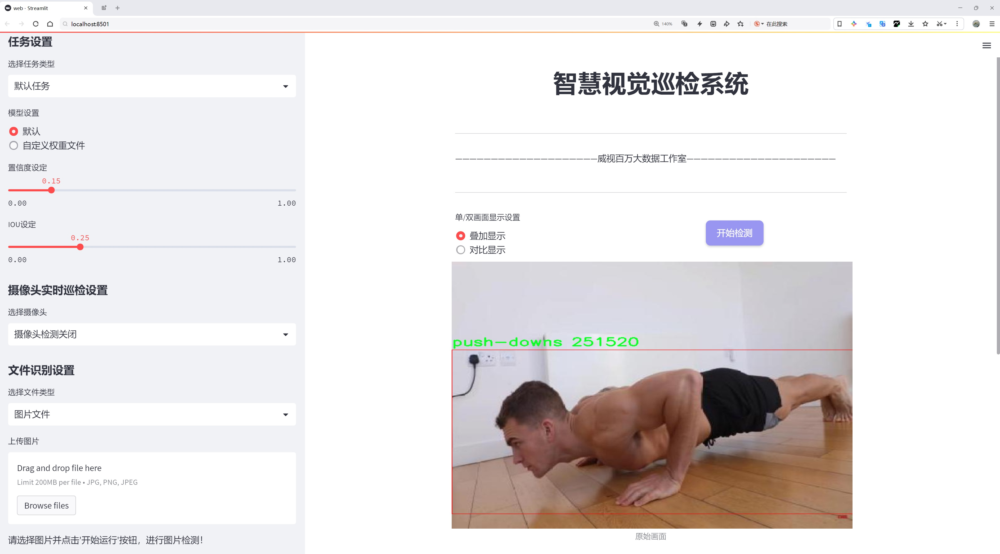
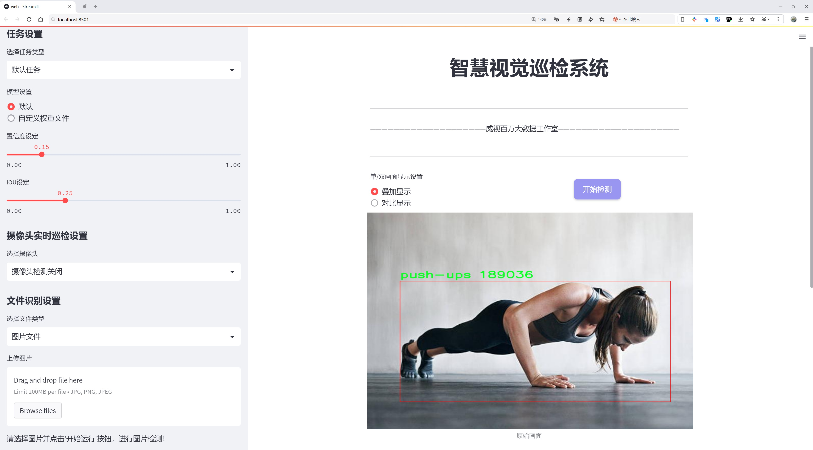
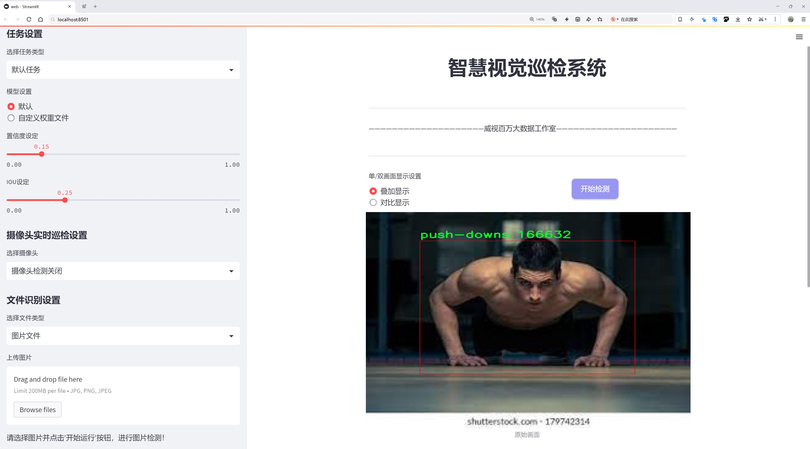
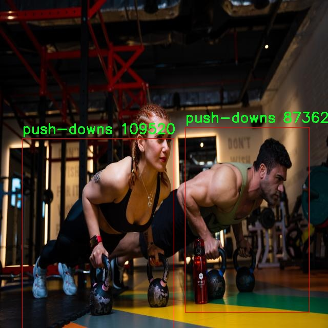
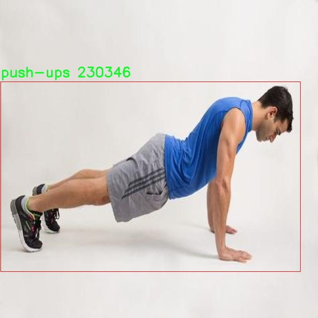

# 俯卧撑动作起伏识别计数检测系统源码分享
 # [一条龙教学YOLOV8标注好的数据集一键训练_70+全套改进创新点发刊_Web前端展示]

### 1.研究背景与意义

项目参考[AAAI Association for the Advancement of Artificial Intelligence](https://gitee.com/qunmasj/projects)

项目来源[AACV Association for the Advancement of Computer Vision](https://kdocs.cn/l/cszuIiCKVNis)

研究背景与意义

随着健身行业的迅速发展，越来越多的人开始关注自身的身体健康和体能锻炼。俯卧撑作为一种简单有效的力量训练方式，因其不需要复杂的器械和场地而受到广泛欢迎。然而，传统的俯卧撑训练往往依赖于个人的自我监测，缺乏科学的计数和姿势评估手段，这不仅影响了训练效果，也可能导致错误的锻炼姿势，从而增加受伤风险。因此，开发一种智能化的俯卧撑动作识别与计数系统，能够实时监测和反馈用户的锻炼情况，具有重要的现实意义。

近年来，深度学习技术的迅猛发展为动作识别领域带来了新的机遇。YOLO（You Only Look Once）系列模型以其高效的实时目标检测能力而受到广泛关注。YOLOv8作为该系列的最新版本，具备更强的特征提取能力和更快的处理速度，能够在复杂环境中进行准确的动作识别。通过对YOLOv8模型的改进，可以更好地适应俯卧撑这一特定动作的识别需求，从而提高识别的准确性和鲁棒性。

本研究旨在基于改进的YOLOv8模型，构建一个俯卧撑动作起伏识别计数系统。该系统将利用一个包含2900张图像的数据集，涵盖了两类动作：俯卧撑向下（push-downs）和俯卧撑向上（push-ups）。通过对这两类动作的精准识别与计数，系统不仅能够为用户提供实时反馈，还能够通过数据分析帮助用户优化训练计划，提升锻炼效果。

在技术层面，本研究将探索如何通过改进YOLOv8模型的网络结构和训练策略，以提高其在俯卧撑动作识别中的表现。具体而言，将关注数据增强、迁移学习等技术手段，以应对训练数据相对有限的挑战。此外，研究还将探讨如何通过多种传感器数据的融合，提升系统的整体性能和用户体验。

从社会意义上看，智能化的俯卧撑动作识别计数系统不仅能够为健身爱好者提供科学的训练指导，还能够推动健身行业的数字化转型。随着人们对健康生活方式的追求日益增强，基于人工智能的健身辅助工具将会在未来的健身市场中占据重要地位。通过本研究的实施，期望能够为健身领域提供一种新的解决方案，促进人们更加科学、有效地进行力量训练，进而提升整体健康水平。

综上所述，基于改进YOLOv8的俯卧撑动作起伏识别计数系统的研究，不仅具有重要的学术价值，也具备广泛的应用前景。通过深入探讨该系统的设计与实现，期望能够为动作识别技术在健身领域的应用提供新的思路和方法，为推动健康生活方式的普及贡献力量。

### 2.图片演示







##### 注意：由于此博客编辑较早，上面“2.图片演示”和“3.视频演示”展示的系统图片或者视频可能为老版本，新版本在老版本的基础上升级如下：（实际效果以升级的新版本为准）

  （1）适配了YOLOV8的“目标检测”模型和“实例分割”模型，通过加载相应的权重（.pt）文件即可自适应加载模型。

  （2）支持“图片识别”、“视频识别”、“摄像头实时识别”三种识别模式。

  （3）支持“图片识别”、“视频识别”、“摄像头实时识别”三种识别结果保存导出，解决手动导出（容易卡顿出现爆内存）存在的问题，识别完自动保存结果并导出到tempDir中。

  （4）支持Web前端系统中的标题、背景图等自定义修改，后面提供修改教程。

  另外本项目提供训练的数据集和训练教程,暂不提供权重文件（best.pt）,需要您按照教程进行训练后实现图片演示和Web前端界面演示的效果。

### 3.视频演示

[3.1 视频演示](https://www.bilibili.com/video/BV1YSsbebEZj/)

### 4.数据集信息展示

##### 4.1 本项目数据集详细数据（类别数＆类别名）

nc: 2
names: ['push-downs', 'push-ups']


##### 4.2 本项目数据集信息介绍

数据集信息展示

在本研究中，我们使用了名为“push up-detection”的数据集，以支持对俯卧撑动作的起伏识别和计数系统的改进。该数据集专门设计用于捕捉和分析俯卧撑这一特定运动的动态表现，旨在为运动科学、健身监测和智能健身设备的开发提供坚实的数据基础。数据集包含两个主要类别，分别是“push-downs”和“push-ups”，这两个类别的划分使得系统能够准确区分俯卧撑的不同阶段，从而实现更精确的动作识别与计数。

“push-downs”类别主要涵盖了俯卧撑下压的动作阶段，这一阶段是俯卧撑过程中最为关键的部分之一。在这一阶段，运动员的身体从起始位置向下移动，直到胸部接近地面。通过对这一动作的细致捕捉，数据集能够提供丰富的样本，帮助算法学习到俯卧撑下压的多样性和变化性。这些样本不仅包括不同体型、性别和年龄段的运动员，还涵盖了不同的俯卧撑变体，例如宽距俯卧撑、窄距俯卧撑等。这种多样性使得训练出的模型能够更好地适应现实世界中各种俯卧撑动作的表现。

另一方面，“push-ups”类别则专注于俯卧撑的上推阶段。在这一阶段，运动员将身体从下压位置推回到起始位置，完成一个完整的俯卧撑动作。数据集中的样本同样涵盖了不同的运动员和俯卧撑变体，确保模型在识别上推动作时具备足够的准确性和鲁棒性。通过对这两个类别的深入分析和训练，改进后的YOLOv8模型将能够实时监测和计数俯卧撑的完成情况，为用户提供即时反馈，帮助他们优化训练效果。

数据集的构建过程注重了数据的多样性和真实性，确保了样本的高质量。每个动作样本都经过精确标注，包含了运动员在不同阶段的关键点信息，这些信息对于动作识别至关重要。此外，数据集还考虑到了不同环境下的拍摄条件，如光照变化、背景杂乱程度等，确保模型在各种实际场景中都能保持良好的识别性能。

通过对“push up-detection”数据集的深入挖掘和分析，我们希望能够为俯卧撑动作的智能识别和计数提供一个高效、准确的解决方案。随着健身科技的不断发展，基于深度学习的运动识别系统将为用户提供更为个性化的训练指导，帮助他们更好地实现健身目标。未来，我们将继续扩展数据集的规模和多样性，以进一步提升模型的性能和适应性，推动智能健身领域的发展。







### 5.全套项目环境部署视频教程（零基础手把手教学）

[5.1 环境部署教程链接（零基础手把手教学）](https://www.ixigua.com/7404473917358506534?logTag=c807d0cbc21c0ef59de5)


[5.2 安装Python虚拟环境创建和依赖库安装视频教程链接（零基础手把手教学）](https://www.ixigua.com/7404474678003106304?logTag=1f1041108cd1f708b01a)

### 6.手把手YOLOV8训练视频教程（零基础小白有手就能学会）

[6.1 手把手YOLOV8训练视频教程（零基础小白有手就能学会）](https://www.ixigua.com/7404477157818401292?logTag=d31a2dfd1983c9668658)

### 7.70+种全套YOLOV8创新点代码加载调参视频教程（一键加载写好的改进模型的配置文件）

[7.1 70+种全套YOLOV8创新点代码加载调参视频教程（一键加载写好的改进模型的配置文件）](https://www.ixigua.com/7404478314661806627?logTag=29066f8288e3f4eea3a4)

### 8.70+种全套YOLOV8创新点原理讲解（非科班也可以轻松写刊发刊，V10版本正在科研待更新）

由于篇幅限制，每个创新点的具体原理讲解就不一一展开，具体见下列网址中的创新点对应子项目的技术原理博客网址【Blog】：


[8.1 70+种全套YOLOV8创新点原理讲解链接](https://gitee.com/qunmasj/good)

### 9.系统功能展示（检测对象为举例，实际内容以本项目数据集为准）

图9.1.系统支持检测结果表格显示

  图9.2.系统支持置信度和IOU阈值手动调节

  图9.3.系统支持自定义加载权重文件best.pt(需要你通过步骤5中训练获得)

  图9.4.系统支持摄像头实时识别

  图9.5.系统支持图片识别

  图9.6.系统支持视频识别

  图9.7.系统支持识别结果文件自动保存

  图9.8.系统支持Excel导出检测结果数据


### 10.原始YOLOV8算法原理

原始YOLOv8算法原理

YOLOv8作为YOLO系列中的最新模型，于2023年1月10日正式发布，标志着计算机视觉领域的一次重要进步。它在目标检测、分类和分割任务中展现出卓越的性能，成为当前最先进的模型之一。与前代模型相比，YOLOv8在精度和执行速度上均有显著提升，充分体现了YOLO系列在技术演进中的持续创新。

YOLOv8的设计理念基于对前几代YOLO模型的深入分析，特别是YOLOv5、YOLOv6和YOLOX等模型的优点，旨在通过改进模型结构和算法来增强其在复杂场景下的表现。其架构的核心由四个主要模块组成：输入端、主干网络、Neck端和输出端。输入端负责对输入图像进行预处理，包括Mosaic数据增强、自适应图像缩放和灰度填充等，以提高模型对不同输入条件的适应能力。

在主干网络中，YOLOv8采用了全新的C2f模块，这一模块通过增加跳层连接和Split操作，取代了传统的C3模块，极大地丰富了特征提取的深度和广度。C2f模块的设计灵感来源于YOLOv7中的ELAN模块，旨在实现更高效的梯度信息传递和特征融合。此模块不仅保留了重要的上下文信息，还通过优化的卷积结构提升了特征提取的效率。

Neck端则基于PAN（Path Aggregation Network）结构，通过上采样和下采样操作对不同尺度的特征图进行融合，确保模型能够有效捕捉到多尺度目标的信息。这一设计使得YOLOv8在处理小目标和高分辨率图像时表现尤为出色，克服了以往模型在复杂背景下对小目标检测能力不足的短板。

输出端的创新同样显著，YOLOv8引入了解耦合头结构，彻底改变了传统的Anchor-Based检测方法，转而采用Anchor-Free策略。这一转变不仅简化了模型的结构，还提高了检测精度和速度。解耦合头的设计使得分类和回归过程能够独立进行，从而在处理复杂场景时，模型能够更好地适应不同的目标特征。

YOLOv8在损失函数的设计上也进行了创新，采用了新的损失计算方法，以提高模型的泛化能力和精确度。具体而言，分类损失使用了二元交叉熵（BCE），而回归损失则结合了分布焦点损失（DFL）和完整交并比损失（CIoU），从而在目标定位和分类的准确性上实现了更好的平衡。

值得注意的是，YOLOv8在模型的规模上提供了多种选择，包括n、s、m、l、x五种不同的模型版本，以满足不同应用场景的需求。这种灵活性使得YOLOv8能够在各种硬件平台上高效运行，从CPU到GPU均可实现优异的性能表现。

总的来说，YOLOv8通过对模型结构的全面优化和创新，结合了多种先进的技术理念，成为当前目标检测领域的佼佼者。其在精度、速度和适应性方面的提升，使得YOLOv8不仅适用于传统的目标检测任务，还能够在复杂环境下进行有效的实例分割和姿态评估，进一步拓宽了其应用范围。

通过引入更为先进的特征提取模块、解耦合的检测头以及优化的损失函数，YOLOv8在实际应用中展现出极高的灵活性和适应性。尽管在复杂水面环境下仍存在小目标检测的挑战，但YOLOv8的设计理念和技术创新为后续的改进和应用奠定了坚实的基础。未来，随着对YOLOv8的不断优化和改进，预计其在各类视觉任务中的表现将更加出色，推动计算机视觉技术的进一步发展。


### 11.项目核心源码讲解（再也不用担心看不懂代码逻辑）

#### 11.1 code\ultralytics\engine\model.py

以下是经过精简和注释的核心代码部分，保留了 YOLO 模型的基本结构和功能。注释详细解释了每个方法和属性的作用。

```python
import inspect
import sys
from pathlib import Path
from typing import Union
from ultralytics.nn import nn  # 引入 nn 模块

class Model(nn.Module):
    """
    YOLO 模型的基础类，统一所有模型的 API。

    属性:
        predictor: 预测器对象。
        model: 模型对象。
        task: 模型任务类型。
        ckpt: 从 *.pt 文件加载的检查点对象。
        cfg: 从 *.yaml 文件加载的模型配置。
    """

    def __init__(self, model: Union[str, Path] = "yolov8n.pt", task=None, verbose=False) -> None:
        """
        初始化 YOLO 模型。

        参数:
            model: 要加载或创建的模型路径或名称，默认为 'yolov8n.pt'。
            task: YOLO 模型的任务类型，默认为 None。
            verbose: 是否启用详细模式。
        """
        super().__init__()
        self.predictor = None  # 预测器
        self.model = None  # 模型对象
        self.task = task  # 任务类型
        self.model_name = str(model).strip()  # 去除空格

        # 检查是否为 Ultralytics HUB 模型
        if self.is_hub_model(model):
            self.session = self._get_hub_session(model)  # 获取 HUB 会话
            model = self.session.model_file

        # 加载或创建新的 YOLO 模型
        model = self.check_model_file(model)  # 检查模型文件
        if Path(model).suffix in (".yaml", ".yml"):
            self._new(model, task=task, verbose=verbose)  # 从配置文件创建新模型
        else:
            self._load(model, task=task)  # 从权重文件加载模型

    def _new(self, cfg: str, task=None, verbose=False):
        """
        从模型配置文件初始化新模型。

        参数:
            cfg: 模型配置文件路径。
            task: 模型任务类型。
            verbose: 是否显示模型信息。
        """
        cfg_dict = self.yaml_model_load(cfg)  # 加载 YAML 配置
        self.cfg = cfg
        self.task = task or self.guess_model_task(cfg_dict)  # 推测任务类型
        self.model = self.create_model(cfg_dict, verbose)  # 创建模型

    def _load(self, weights: str, task=None):
        """
        从权重文件加载模型。

        参数:
            weights: 模型权重文件路径。
            task: 模型任务类型。
        """
        self.model, self.ckpt = self.attempt_load_one_weight(weights)  # 加载权重
        self.task = self.model.args["task"]  # 获取任务类型

    def predict(self, source=None, stream=False, **kwargs):
        """
        使用 YOLO 模型进行预测。

        参数:
            source: 输入源，可以是文件路径、视频流等。
            stream: 是否以流模式进行预测。
            **kwargs: 其他传递给预测器的参数。

        返回:
            预测结果列表。
        """
        if source is None:
            source = "default_source"  # 默认源
        # 处理预测逻辑
        if not self.predictor:
            self.predictor = self.load_predictor(kwargs)  # 加载预测器
        return self.predictor.predict(source=source, stream=stream)  # 返回预测结果

    def is_hub_model(self, model):
        """检查提供的模型是否为 HUB 模型。"""
        return model.startswith("https://hub.ultralytics.com/models/")

    def _get_hub_session(self, model: str):
        """创建 HUB 训练会话。"""
        from ultralytics.hub.session import HUBTrainingSession
        session = HUBTrainingSession(model)
        return session if session.client.authenticated else None

    @property
    def names(self):
        """返回加载模型的类名。"""
        return self.model.names if hasattr(self.model, "names") else None

    @property
    def device(self):
        """返回模型的设备信息。"""
        return next(self.model.parameters()).device if isinstance(self.model, nn.Module) else None

    # 其他方法和属性可以根据需要添加
```

### 代码说明：
1. **Model 类**：继承自 `nn.Module`，是 YOLO 模型的基础类，统一了模型的 API。
2. **`__init__` 方法**：初始化模型，支持从文件加载模型或创建新模型。
3. **`_new` 和 `_load` 方法**：分别用于从配置文件和权重文件加载模型。
4. **`predict` 方法**：执行预测，处理输入源和流模式。
5. **`is_hub_model` 和 `_get_hub_session` 方法**：用于检查模型是否来自 Ultralytics HUB 并创建会话。
6. **属性**：如 `names` 和 `device` 提供了对模型相关信息的访问。

以上代码展示了 YOLO 模型的核心结构和基本功能，便于理解和扩展。

这个文件是Ultralytics YOLO模型的核心实现部分，主要定义了一个名为`Model`的类，该类用于统一处理各种YOLO模型的API。该类的构造函数接收模型的路径或名称，以及任务类型和是否启用详细模式的参数。初始化过程中，模型会根据提供的路径加载或创建。

在`Model`类中，包含多个重要的属性和方法。属性包括预测器、模型对象、训练器、任务类型、检查点对象、配置文件路径、覆盖参数和度量数据等。方法方面，`__call__`方法是对`predict`方法的别名，允许用户通过调用实例来进行预测。

该类还提供了多种功能，例如加载新模型、检查模型是否为PyTorch模型、重置模型权重、加载权重、记录模型信息、融合模型层以加快推理速度等。特别是`predict`方法是该类的核心功能之一，负责执行目标检测，接受多种类型的输入源（如文件路径、图像、视频流等），并返回预测结果。

此外，`track`方法用于在输入源上执行对象跟踪，`val`方法用于在给定数据集上验证模型，`train`方法则用于训练模型。还有`export`方法用于导出模型，`benchmark`方法用于基准测试模型在不同导出格式下的性能。

在类的设计中，还考虑了与Ultralytics HUB的集成，允许从HUB获取模型，并支持Triton Server模型的使用。类中包含了对回调函数的管理，允许用户在特定事件发生时添加自定义回调。

最后，`task_map`属性是一个任务映射，用户需要为其提供具体的任务映射，以便根据任务类型加载相应的模型、训练器、验证器和预测器。整体来看，这个文件提供了一个灵活且功能强大的框架，用于处理YOLO模型的训练、验证和推理等任务。

#### 11.2 code\ultralytics\nn\modules\head.py

以下是经过简化和注释的核心代码部分，主要集中在YOLOv8的检测头（Detect类）和相关功能上：

```python
import torch
import torch.nn as nn
from .utils import dist2bbox, make_anchors  # 导入辅助函数

class Detect(nn.Module):
    """YOLOv8检测头，用于目标检测模型。"""

    def __init__(self, nc=80, ch=()):
        """初始化YOLOv8检测层，指定类别数和通道数。
        
        参数:
        nc (int): 类别数，默认为80。
        ch (tuple): 输入通道数的元组。
        """
        super().__init__()
        self.nc = nc  # 类别数
        self.nl = len(ch)  # 检测层数
        self.reg_max = 16  # DFL通道数
        self.no = nc + self.reg_max * 4  # 每个锚点的输出数量
        self.stride = torch.zeros(self.nl)  # 在构建时计算的步幅

        # 定义卷积层
        c2 = max((16, ch[0] // 4, self.reg_max * 4))
        c3 = max(ch[0], min(self.nc, 100))
        self.cv2 = nn.ModuleList(
            nn.Sequential(Conv(x, c2, 3), Conv(c2, c2, 3), nn.Conv2d(c2, 4 * self.reg_max, 1)) for x in ch
        )
        self.cv3 = nn.ModuleList(nn.Sequential(Conv(x, c3, 3), Conv(c3, c3, 3), nn.Conv2d(c3, self.nc, 1)) for x in ch)
        self.dfl = DFL(self.reg_max) if self.reg_max > 1 else nn.Identity()  # DFL层

    def forward(self, x):
        """前向传播，返回预测的边界框和类别概率。
        
        参数:
        x (list): 输入特征图列表。
        
        返回:
        y (Tensor): 包含边界框和类别概率的张量。
        """
        for i in range(self.nl):
            # 将每个层的输出进行拼接
            x[i] = torch.cat((self.cv2[i](x[i]), self.cv3[i](x[i])), 1)
        
        shape = x[0].shape  # 获取输入形状
        x_cat = torch.cat([xi.view(shape[0], self.no, -1) for xi in x], 2)  # 拼接所有层的输出

        # 动态锚点和步幅计算
        if self.shape != shape:
            self.anchors, self.strides = make_anchors(x, self.stride, 0.5)
            self.shape = shape

        # 解码边界框
        box, cls = x_cat.split((self.reg_max * 4, self.nc), 1)  # 分离边界框和类别
        dbox = self.decode_bboxes(box)  # 解码边界框

        # 返回拼接后的边界框和类别概率
        return torch.cat((dbox, cls.sigmoid()), 1)

    def decode_bboxes(self, bboxes):
        """解码边界框。
        
        参数:
        bboxes (Tensor): 输入边界框张量。
        
        返回:
        Tensor: 解码后的边界框。
        """
        return dist2bbox(self.dfl(bboxes), self.anchors.unsqueeze(0), xywh=True, dim=1) * self.strides  # 通过DFL解码

# 示例用法
# model = Detect(nc=80, ch=(256, 512, 1024))
# output = model(input_tensor)  # 输入特征图
```

### 代码说明：
1. **Detect类**：这是YOLOv8的检测头，负责处理输入特征图并生成边界框和类别概率。
2. **初始化方法**：设置类别数、通道数、卷积层等。
3. **forward方法**：实现前向传播，拼接不同层的输出，计算锚点和步幅，并解码边界框。
4. **decode_bboxes方法**：将模型输出的边界框进行解码，转换为实际的坐标。

通过这些核心部分和注释，可以更好地理解YOLOv8检测头的功能和实现方式。

这个程序文件是一个实现YOLOv8模型头部模块的Python代码，主要用于目标检测、分割、姿态估计和分类等任务。代码中定义了多个类，每个类代表了不同的模型头部，负责处理输入数据并生成相应的输出。

首先，文件导入了必要的库，包括PyTorch和一些自定义的模块。然后定义了一个`Detect`类，这是YOLOv8检测头的核心部分。该类的构造函数接受类别数量和通道数作为参数，并初始化了一些重要的属性，如锚框、输出数量和卷积层。`forward`方法实现了前向传播，处理输入特征并返回预测的边界框和类别概率。在训练和推理过程中，该方法的行为有所不同，确保模型在不同阶段的输出符合要求。

接下来，`Segment`类继承自`Detect`类，专门用于分割任务。它增加了对掩码和原型的处理，允许模型在输出中同时返回分割掩码和检测结果。`OBB`类同样继承自`Detect`，但它专注于旋转边界框的检测，处理额外的参数以表示旋转角度。

`Pose`类则用于姿态估计，输出关键点的位置。它在构造函数中定义了关键点的形状，并在前向传播中处理关键点的预测。

`Classify`类是一个独立的分类头，负责将输入图像转换为类别概率。它通过卷积层、池化层和线性层来实现这一功能。

最后，`RTDETRDecoder`类实现了一个实时可变形Transformer解码器，结合了Transformer架构和可变形卷积，能够对图像中的物体进行检测。该类的构造函数接受多个参数来配置解码器的行为，并在`forward`方法中处理输入特征，生成边界框和分类分数。

整体而言，这个文件实现了YOLOv8模型的不同头部模块，涵盖了目标检测、分割、姿态估计和分类等多种功能，利用深度学习技术来处理复杂的视觉任务。每个类的设计都考虑到了特定任务的需求，并通过合理的网络结构和前向传播逻辑来实现高效的模型推理。

#### 11.3 ui.py

以下是经过简化和注释的核心代码部分：

```python
import sys
import subprocess

def run_script(script_path):
    """
    使用当前 Python 环境运行指定的脚本。

    Args:
        script_path (str): 要运行的脚本路径

    Returns:
        None
    """
    # 获取当前 Python 解释器的路径
    python_path = sys.executable

    # 构建运行命令，使用 streamlit 运行指定的脚本
    command = f'"{python_path}" -m streamlit run "{script_path}"'

    # 执行命令并等待其完成
    result = subprocess.run(command, shell=True)
    
    # 检查命令执行结果，如果返回码不为0，则表示出错
    if result.returncode != 0:
        print("脚本运行出错。")

# 主程序入口
if __name__ == "__main__":
    # 指定要运行的脚本路径
    script_path = "web.py"  # 这里可以直接指定脚本名，假设它在当前目录下

    # 调用函数运行脚本
    run_script(script_path)
```

### 代码注释说明：
1. **导入模块**：
   - `sys`：用于获取当前 Python 解释器的路径。
   - `subprocess`：用于执行外部命令。

2. **`run_script` 函数**：
   - 接收一个参数 `script_path`，表示要运行的 Python 脚本的路径。
   - 使用 `sys.executable` 获取当前 Python 解释器的路径，以确保在当前环境中运行脚本。
   - 构建命令字符串，使用 `streamlit` 模块运行指定的脚本。
   - 使用 `subprocess.run` 执行命令，并等待其完成。
   - 检查命令的返回码，如果不为0，表示脚本运行出错，打印错误信息。

3. **主程序入口**：
   - 当脚本作为主程序运行时，指定要运行的脚本路径（这里假设脚本在当前目录下）。
   - 调用 `run_script` 函数执行指定的脚本。

这个程序文件的主要功能是使用当前的 Python 环境来运行一个指定的脚本，具体来说是一个名为 `web.py` 的脚本。程序首先导入了必要的模块，包括 `sys`、`os` 和 `subprocess`，这些模块提供了与系统交互和执行外部命令的功能。此外，还导入了 `abs_path` 函数，这个函数来自于 `QtFusion.path` 模块，用于获取文件的绝对路径。

在 `run_script` 函数中，首先获取当前 Python 解释器的路径，这样可以确保使用正确的 Python 环境来运行脚本。接着，构建一个命令字符串，这个命令使用了 `streamlit` 模块来运行指定的脚本。`streamlit` 是一个用于构建数据应用的框架，`-m` 参数表示以模块的方式运行。

然后，使用 `subprocess.run` 方法来执行这个命令。这个方法会在一个新的 shell 中运行命令，并等待其完成。如果脚本运行过程中出现错误，返回的 `returncode` 将不为零，此时程序会打印出“脚本运行出错”的提示信息。

在文件的最后部分，使用 `if __name__ == "__main__":` 语句来确保只有在直接运行该文件时才会执行后面的代码。在这里，首先调用 `abs_path` 函数来获取 `web.py` 的绝对路径，然后调用 `run_script` 函数来运行这个脚本。

总的来说，这个程序的作用是为用户提供一个简单的方式来运行一个特定的 Python 脚本，并且在运行过程中能够处理可能出现的错误。

#### 11.4 code\ultralytics\solutions\heatmap.py

以下是代码中最核心的部分，并附上详细的中文注释：

```python
import cv2
import numpy as np
from collections import defaultdict
from shapely.geometry import LineString, Point, Polygon

class Heatmap:
    """用于实时视频流中根据轨迹绘制热图的类。"""

    def __init__(self):
        """初始化热图类，设置默认的可视化、图像、跟踪和热图参数。"""
        # 可视化信息
        self.annotator = None  # 注释器
        self.view_img = False  # 是否显示图像
        self.shape = "circle"  # 热图形状，默认为圆形

        # 图像信息
        self.imw = None  # 图像宽度
        self.imh = None  # 图像高度
        self.im0 = None  # 原始图像
        self.view_in_counts = True  # 是否显示进入计数
        self.view_out_counts = True  # 是否显示离开计数

        # 热图颜色映射和热图数组
        self.colormap = None  # 热图颜色映射
        self.heatmap = None  # 热图数组
        self.heatmap_alpha = 0.5  # 热图透明度

        # 预测/跟踪信息
        self.boxes = None  # 检测框
        self.track_ids = None  # 跟踪ID
        self.clss = None  # 类别
        self.track_history = defaultdict(list)  # 跟踪历史

        # 区域和线信息
        self.count_reg_pts = None  # 计数区域点
        self.counting_region = None  # 计数区域
        self.line_dist_thresh = 15  # 线计数的距离阈值
        self.region_thickness = 5  # 区域厚度
        self.region_color = (255, 0, 255)  # 区域颜色

        # 物体计数信息
        self.in_counts = 0  # 进入计数
        self.out_counts = 0  # 离开计数
        self.counting_list = []  # 正在计数的物体列表
        self.count_txt_thickness = 0  # 计数文本厚度
        self.count_txt_color = (0, 0, 0)  # 计数文本颜色
        self.count_color = (255, 255, 255)  # 计数背景颜色

        # 衰减因子
        self.decay_factor = 0.99  # 热图衰减因子

    def set_args(self, imw, imh, colormap=cv2.COLORMAP_JET, heatmap_alpha=0.5, view_img=False,
                 view_in_counts=True, view_out_counts=True, count_reg_pts=None,
                 count_txt_thickness=2, count_txt_color=(0, 0, 0), count_color=(255, 255, 255),
                 count_reg_color=(255, 0, 255), region_thickness=5, line_dist_thresh=15,
                 decay_factor=0.99, shape="circle"):
        """
        配置热图的颜色映射、宽度、高度和显示参数。
        """
        self.imw = imw  # 设置图像宽度
        self.imh = imh  # 设置图像高度
        self.heatmap_alpha = heatmap_alpha  # 设置热图透明度
        self.view_img = view_img  # 设置是否显示图像
        self.view_in_counts = view_in_counts  # 设置是否显示进入计数
        self.view_out_counts = view_out_counts  # 设置是否显示离开计数
        self.colormap = colormap  # 设置热图颜色映射

        # 区域和线选择
        if count_reg_pts is not None:
            if len(count_reg_pts) == 2:  # 线计数
                self.count_reg_pts = count_reg_pts
                self.counting_region = LineString(count_reg_pts)
            elif len(count_reg_pts) == 4:  # 区域计数
                self.count_reg_pts = count_reg_pts
                self.counting_region = Polygon(self.count_reg_pts)
            else:
                print("区域或线点无效，仅支持2或4个点")
                self.counting_region = Polygon([(20, 400), (1260, 400)])  # 默认线

        # 初始化热图
        self.heatmap = np.zeros((int(self.imh), int(self.imw)), dtype=np.float32)

        # 设置其他参数
        self.count_txt_thickness = count_txt_thickness
        self.count_txt_color = count_txt_color
        self.count_color = count_color
        self.region_color = count_reg_color
        self.region_thickness = region_thickness
        self.decay_factor = decay_factor
        self.line_dist_thresh = line_dist_thresh
        self.shape = shape

    def extract_results(self, tracks):
        """
        从提供的数据中提取结果。
        """
        self.boxes = tracks[0].boxes.xyxy.cpu()  # 提取检测框
        self.clss = tracks[0].boxes.cls.cpu().tolist()  # 提取类别
        self.track_ids = tracks[0].boxes.id.int().cpu().tolist()  # 提取跟踪ID

    def generate_heatmap(self, im0, tracks):
        """
        根据跟踪数据生成热图。
        """
        self.im0 = im0  # 保存当前图像
        if tracks[0].boxes.id is None:  # 如果没有检测到物体
            return
        self.heatmap *= self.decay_factor  # 应用衰减因子
        self.extract_results(tracks)  # 提取跟踪结果

        # 绘制计数区域
        if self.count_reg_pts is not None:
            for box, cls, track_id in zip(self.boxes, self.clss, self.track_ids):
                # 根据形状绘制热图
                if self.shape == "circle":
                    center = (int((box[0] + box[2]) // 2), int((box[1] + box[3]) // 2))
                    radius = min(int(box[2]) - int(box[0]), int(box[3]) - int(box[1])) // 2
                    y, x = np.ogrid[0 : self.heatmap.shape[0], 0 : self.heatmap.shape[1]]
                    mask = (x - center[0]) ** 2 + (y - center[1]) ** 2 <= radius**2
                    self.heatmap[int(box[1]) : int(box[3]), int(box[0]) : int(box[2])] += (
                        2 * mask[int(box[1]) : int(box[3]), int(box[0]) : int(box[2])]
                    )
                else:
                    self.heatmap[int(box[1]) : int(box[3]), int(box[0]) : int(box[2])] += 2

                # 物体计数逻辑
                track_line = self.track_history[track_id]
                track_line.append((float((box[0] + box[2]) / 2), float((box[1] + box[3]) / 2)))
                if len(track_line) > 30:
                    track_line.pop(0)

                # 计数区域内的物体计数
                if len(self.count_reg_pts) == 4:
                    if self.counting_region.contains(Point(track_line[-1])) and track_id not in self.counting_list:
                        self.counting_list.append(track_id)
                        if box[0] < self.counting_region.centroid.x:
                            self.out_counts += 1
                        else:
                            self.in_counts += 1

                elif len(self.count_reg_pts) == 2:
                    distance = Point(track_line[-1]).distance(self.counting_region)
                    if distance < self.line_dist_thresh and track_id not in self.counting_list:
                        self.counting_list.append(track_id)
                        if box[0] < self.counting_region.centroid.x:
                            self.out_counts += 1
                        else:
                            self.in_counts += 1

        # 归一化热图并与原始图像合成
        heatmap_normalized = cv2.normalize(self.heatmap, None, 0, 255, cv2.NORM_MINMAX)
        heatmap_colored = cv2.applyColorMap(heatmap_normalized.astype(np.uint8), self.colormap)
        self.im0 = cv2.addWeighted(self.im0, 1 - self.heatmap_alpha, heatmap_colored, self.heatmap_alpha, 0)

        return self.im0  # 返回合成后的图像

    def display_frames(self):
        """显示当前帧。"""
        cv2.imshow("Ultralytics Heatmap", self.im0)
        if cv2.waitKey(1) & 0xFF == ord("q"):
            return  # 按'q'键退出

if __name__ == "__main__":
    Heatmap()  # 创建Heatmap实例
```

### 代码说明：
1. **类定义**：`Heatmap`类用于处理热图的生成和显示。
2. **初始化方法**：`__init__`方法设置了一些默认参数，包括可视化信息、图像信息、热图参数等。
3. **参数设置**：`set_args`方法用于配置热图的参数，包括图像的宽度、高度、颜色映射等。
4. **结果提取**：`extract_results`方法从跟踪数据中提取检测框、类别和跟踪ID。
5. **生成热图**：`generate_heatmap`方法根据跟踪数据生成热图，并进行物体计数。
6. **显示帧**：`display_frames`方法用于显示当前处理的图像帧。

该代码的核心功能是实时生成热图并进行物体计数，适用于监控和分析视频流中的物体动态。

这个程序文件定义了一个名为 `Heatmap` 的类，用于在实时视频流中基于物体轨迹绘制热图。该类包含多个方法和属性，用于初始化热图、配置参数、提取跟踪结果、生成热图以及显示帧。

在初始化方法 `__init__` 中，类的各个属性被设置为默认值，包括视觉信息、图像信息、热图的颜色映射和数组、跟踪信息、计数区域和线的信息、物体计数信息以及衰减因子等。它还检查环境是否支持图像显示。

`set_args` 方法用于配置热图的参数，包括图像的宽度和高度、颜色映射、透明度、是否显示图像、计数区域的点、文本厚度和颜色等。该方法还会根据传入的计数区域点的数量（2或4个）来初始化计数区域，支持线计数和区域计数。

`extract_results` 方法从跟踪数据中提取结果，包括边界框、类别和跟踪ID。

`generate_heatmap` 方法是核心功能，负责生成热图。它首先检查跟踪数据是否有效，然后应用衰减因子更新热图。接着，它提取跟踪结果，并使用 `Annotator` 类绘制计数区域。根据跟踪的物体，热图会在相应的位置进行更新，支持圆形和矩形的热图形状。该方法还会根据物体的运动情况进行计数，并更新进入和离开的计数。

最后，热图会被归一化并与原始图像结合显示。用户可以选择是否显示进入和离开的计数信息。`display_frames` 方法用于显示当前帧，并允许用户通过按下“q”键退出。

整体来看，这个类实现了实时视频流中物体跟踪和热图生成的功能，适用于监控、交通分析等场景。

#### 11.5 code\ultralytics\data\explorer\explorer.py

以下是代码中最核心的部分，并附上详细的中文注释：

```python
class Explorer:
    def __init__(self, data: Union[str, Path] = "coco128.yaml", model: str = "yolov8n.pt", uri: str = "~/ultralytics/explorer") -> None:
        # 初始化Explorer类，设置数据集路径、模型路径和数据库连接URI
        checks.check_requirements(["lancedb>=0.4.3", "duckdb"])  # 检查所需的库是否已安装
        import lancedb  # 导入lancedb库用于数据库操作

        self.connection = lancedb.connect(uri)  # 连接到LanceDB数据库
        self.table_name = Path(data).name.lower() + "_" + model.lower()  # 设置表名
        self.sim_idx_base_name = f"{self.table_name}_sim_idx".lower()  # 设置相似度索引的基本名称
        self.model = YOLO(model)  # 加载YOLO模型
        self.data = data  # 数据集路径
        self.choice_set = None  # 选择的数据集

        self.table = None  # 数据库表
        self.progress = 0  # 进度条

    def create_embeddings_table(self, force: bool = False, split: str = "train") -> None:
        """
        创建包含数据集中图像嵌入的LanceDB表。如果表已存在，将重用该表。
        可以通过设置force=True来覆盖现有表。
        """
        if self.table is not None and not force:
            LOGGER.info("Table already exists. Reusing it. Pass force=True to overwrite it.")
            return
        if self.table_name in self.connection.table_names() and not force:
            LOGGER.info(f"Table {self.table_name} already exists. Reusing it. Pass force=True to overwrite it.")
            self.table = self.connection.open_table(self.table_name)
            self.progress = 1
            return
        if self.data is None:
            raise ValueError("Data must be provided to create embeddings table")

        data_info = check_det_dataset(self.data)  # 检查数据集的信息
        if split not in data_info:
            raise ValueError(f"Split {split} is not found in the dataset. Available keys in the dataset are {list(data_info.keys())}")

        choice_set = data_info[split]  # 获取指定分割的数据集
        choice_set = choice_set if isinstance(choice_set, list) else [choice_set]
        self.choice_set = choice_set
        dataset = ExplorerDataset(img_path=choice_set, data=data_info, augment=False, cache=False, task=self.model.task)

        # 创建表的模式
        batch = dataset[0]  # 获取数据集的第一个批次
        vector_size = self.model.embed(batch["im_file"], verbose=False)[0].shape[0]  # 获取嵌入向量的大小
        table = self.connection.create_table(self.table_name, schema=get_table_schema(vector_size), mode="overwrite")  # 创建数据库表
        table.add(
            self._yield_batches(
                dataset,
                data_info,
                self.model,
                exclude_keys=["img", "ratio_pad", "resized_shape", "ori_shape", "batch_idx"],
            )
        )  # 将数据批次添加到表中

        self.table = table  # 保存表的引用

    def query(self, imgs: Union[str, np.ndarray, List[str], List[np.ndarray]] = None, limit: int = 25) -> Any:
        """
        查询表以获取相似图像。接受单个图像或图像列表。
        """
        if self.table is None:
            raise ValueError("Table is not created. Please create the table first.")
        if isinstance(imgs, str):
            imgs = [imgs]  # 如果是单个图像路径，则转换为列表
        assert isinstance(imgs, list), f"img must be a string or a list of strings. Got {type(imgs)}"
        embeds = self.model.embed(imgs)  # 获取图像的嵌入向量
        embeds = torch.mean(torch.stack(embeds), 0).cpu().numpy() if len(embeds) > 1 else embeds[0].cpu().numpy()  # 计算多个图像的平均嵌入
        return self.table.search(embeds).limit(limit).to_arrow()  # 查询相似图像并返回结果

    def similarity_index(self, max_dist: float = 0.2, top_k: float = None, force: bool = False) -> DataFrame:
        """
        计算表中所有图像的相似度索引。索引将包含在给定索引的嵌入空间中距离最大值为max_dist或更近的数据点。
        """
        if self.table is None:
            raise ValueError("Table is not created. Please create the table first.")
        sim_idx_table_name = f"{self.sim_idx_base_name}_thres_{max_dist}_top_{top_k}".lower()
        if sim_idx_table_name in self.connection.table_names() and not force:
            LOGGER.info("Similarity matrix already exists. Reusing it. Pass force=True to overwrite it.")
            return self.connection.open_table(sim_idx_table_name).to_pandas()

        if top_k and not (1.0 >= top_k >= 0.0):
            raise ValueError(f"top_k must be between 0.0 and 1.0. Got {top_k}")
        if max_dist < 0.0:
            raise ValueError(f"max_dist must be greater than 0. Got {max_dist}")

        top_k = int(top_k * len(self.table)) if top_k else len(self.table)  # 计算要考虑的最近邻数量
        top_k = max(top_k, 1)
        features = self.table.to_lance().to_table(columns=["vector", "im_file"]).to_pydict()  # 获取特征
        im_files = features["im_file"]
        embeddings = features["vector"]

        sim_table = self.connection.create_table(sim_idx_table_name, schema=get_sim_index_schema(), mode="overwrite")  # 创建相似度索引表

        def _yield_sim_idx():
            """生成包含相似度索引和距离的数据框"""
            for i in tqdm(range(len(embeddings))):
                sim_idx = self.table.search(embeddings[i]).limit(top_k).to_pandas().query(f"_distance <= {max_dist}")  # 查询相似图像
                yield [
                    {
                        "idx": i,
                        "im_file": im_files[i],
                        "count": len(sim_idx),
                        "sim_im_files": sim_idx["im_file"].tolist(),
                    }
                ]

        sim_table.add(_yield_sim_idx())  # 将相似度索引添加到表中
        self.sim_index = sim_table  # 保存相似度索引的引用
        return sim_table.to_pandas()  # 返回相似度索引的DataFrame
```

### 代码核心部分说明：
1. **Explorer类**：负责处理图像数据集的加载、嵌入生成、相似度查询等功能。
2. **初始化方法**：设置数据集路径、模型路径和数据库连接，并进行必要的库检查。
3. **create_embeddings_table方法**：创建一个数据库表来存储图像的嵌入向量，如果表已存在，可以选择覆盖。
4. **query方法**：查询相似图像，接受单个图像或图像列表，返回相似图像的结果。
5. **similarity_index方法**：计算所有图像的相似度索引，返回包含相似图像信息的DataFrame。

以上代码及注释涵盖了主要的功能和逻辑，便于理解和使用。

这个程序文件是一个用于图像数据集探索和查询的工具，主要实现了对YOLO（You Only Look Once）模型的支持。它包含了两个主要的类：`ExplorerDataset`和`Explorer`。`ExplorerDataset`类继承自`YOLODataset`，用于加载和处理数据集中的图像，而`Explorer`类则提供了对图像嵌入的创建、查询和相似性分析等功能。

在`ExplorerDataset`类中，`load_image`方法用于从数据集中加载图像，并返回图像的原始尺寸和当前尺寸。如果图像未缓存，则会尝试从文件中读取或加载NumPy数组。`build_transforms`方法创建图像的转换操作，主要用于格式化边界框和处理掩码。

`Explorer`类的构造函数接收数据集的路径、模型文件和数据库URI等参数，并进行必要的检查和初始化。`create_embeddings_table`方法用于创建一个LanceDB表，存储数据集中图像的嵌入向量。如果表已经存在且未强制覆盖，则会重用现有表。该方法还会检查数据集的有效性，并根据指定的分割（如训练集）加载数据。

`_yield_batches`方法生成图像的批次数据，用于嵌入计算。`query`方法允许用户根据输入的图像查询相似图像，返回相应的结果表。`sql_query`方法支持执行SQL风格的查询，允许用户对表中的数据进行更复杂的筛选。

此外，`plot_sql_query`和`plot_similar`方法提供了可视化查询结果的功能。`similarity_index`方法计算图像之间的相似性索引，返回一个包含相似图像及其距离的DataFrame。`plot_similarity_index`方法则可视化相似性索引的结果。

该类还提供了`ask_ai`方法，允许用户通过自然语言查询获取图像数据的过滤结果。`visualize`和`generate_report`方法目前尚未实现，可能用于未来的扩展。

整体而言，这个程序文件为用户提供了一个强大的工具，用于处理和分析图像数据集，利用YOLO模型进行嵌入计算，并支持多种查询和可视化功能。

#### 11.6 train.py

以下是经过简化和注释的核心代码部分，主要保留了与YOLO模型训练相关的功能和方法：

```python
import random
import numpy as np
import torch.nn as nn
from ultralytics.data import build_dataloader, build_yolo_dataset
from ultralytics.engine.trainer import BaseTrainer
from ultralytics.models import yolo
from ultralytics.nn.tasks import DetectionModel
from ultralytics.utils import LOGGER, RANK
from ultralytics.utils.torch_utils import de_parallel, torch_distributed_zero_first

class DetectionTrainer(BaseTrainer):
    """
    扩展自BaseTrainer类，用于基于检测模型的训练。
    """

    def build_dataset(self, img_path, mode="train", batch=None):
        """
        构建YOLO数据集。

        参数:
            img_path (str): 包含图像的文件夹路径。
            mode (str): 模式，`train`或`val`，用户可以为每种模式自定义不同的增强。
            batch (int, optional): 批次大小，适用于`rect`模式。默认为None。
        """
        gs = max(int(de_parallel(self.model).stride.max() if self.model else 0), 32)
        return build_yolo_dataset(self.args, img_path, batch, self.data, mode=mode, rect=mode == "val", stride=gs)

    def get_dataloader(self, dataset_path, batch_size=16, rank=0, mode="train"):
        """构造并返回数据加载器。"""
        assert mode in ["train", "val"]
        with torch_distributed_zero_first(rank):  # 仅在DDP中初始化数据集*.cache一次
            dataset = self.build_dataset(dataset_path, mode, batch_size)
        shuffle = mode == "train"  # 训练模式下打乱数据
        workers = self.args.workers if mode == "train" else self.args.workers * 2
        return build_dataloader(dataset, batch_size, workers, shuffle, rank)  # 返回数据加载器

    def preprocess_batch(self, batch):
        """对一批图像进行预处理，包括缩放和转换为浮点数。"""
        batch["img"] = batch["img"].to(self.device, non_blocking=True).float() / 255  # 将图像转换为浮点数并归一化
        if self.args.multi_scale:  # 如果启用多尺度
            imgs = batch["img"]
            sz = (
                random.randrange(self.args.imgsz * 0.5, self.args.imgsz * 1.5 + self.stride)
                // self.stride
                * self.stride
            )  # 随机选择尺寸
            sf = sz / max(imgs.shape[2:])  # 计算缩放因子
            if sf != 1:
                ns = [
                    math.ceil(x * sf / self.stride) * self.stride for x in imgs.shape[2:]
                ]  # 计算新的形状
                imgs = nn.functional.interpolate(imgs, size=ns, mode="bilinear", align_corners=False)  # 进行插值缩放
            batch["img"] = imgs
        return batch

    def get_model(self, cfg=None, weights=None, verbose=True):
        """返回YOLO检测模型。"""
        model = DetectionModel(cfg, nc=self.data["nc"], verbose=verbose and RANK == -1)
        if weights:
            model.load(weights)  # 加载权重
        return model

    def plot_training_samples(self, batch, ni):
        """绘制带有注释的训练样本。"""
        plot_images(
            images=batch["img"],
            batch_idx=batch["batch_idx"],
            cls=batch["cls"].squeeze(-1),
            bboxes=batch["bboxes"],
            paths=batch["im_file"],
            fname=self.save_dir / f"train_batch{ni}.jpg",
            on_plot=self.on_plot,
        )

    def plot_metrics(self):
        """从CSV文件中绘制指标。"""
        plot_results(file=self.csv, on_plot=self.on_plot)  # 保存结果图
```

### 代码说明：
1. **类 `DetectionTrainer`**: 这是一个用于训练YOLO检测模型的类，继承自`BaseTrainer`。
2. **`build_dataset` 方法**: 用于构建YOLO数据集，支持训练和验证模式。
3. **`get_dataloader` 方法**: 创建数据加载器，处理数据的打乱和工作线程数量。
4. **`preprocess_batch` 方法**: 对输入的图像批次进行预处理，包括归一化和可选的多尺度调整。
5. **`get_model` 方法**: 返回一个YOLO检测模型，并可选择加载预训练权重。
6. **`plot_training_samples` 方法**: 绘制训练样本及其注释，用于可视化训练过程。
7. **`plot_metrics` 方法**: 从CSV文件中绘制训练指标，帮助监控训练效果。

这些方法和功能是训练YOLO模型的核心部分，提供了数据处理、模型构建和结果可视化的基本框架。

这个程序文件 `train.py` 是一个用于训练目标检测模型的代码，主要基于 YOLO（You Only Look Once）架构。文件中定义了一个名为 `DetectionTrainer` 的类，该类继承自 `BaseTrainer`，并专门用于处理目标检测任务。

在类的构造中，首先定义了一个用于构建数据集的方法 `build_dataset`，该方法接收图像路径、模式（训练或验证）和批量大小作为参数。它使用 `build_yolo_dataset` 函数来创建 YOLO 数据集，确保在验证模式下采用适当的图像处理方式。

接着，`get_dataloader` 方法用于构建数据加载器。该方法根据模式（训练或验证）初始化数据集，并返回一个数据加载器，支持多线程加载数据。它还会处理一些警告，例如在使用矩形模式时，无法对数据进行随机打乱。

`preprocess_batch` 方法负责对每个批次的图像进行预处理，包括将图像缩放到合适的大小并转换为浮点数格式。它还支持多尺度训练，随机选择图像的大小以增强模型的鲁棒性。

`set_model_attributes` 方法用于设置模型的属性，包括类别数量和类别名称等。这些信息对于模型的训练和评估是必要的。

`get_model` 方法用于返回一个 YOLO 检测模型，可以根据给定的配置和权重加载模型。

`get_validator` 方法返回一个用于模型验证的对象，主要用于计算损失和评估模型性能。

`label_loss_items` 方法用于返回带有标签的训练损失项字典，这对于目标检测任务是必要的，因为需要跟踪不同类型的损失。

`progress_string` 方法返回一个格式化的字符串，用于显示训练进度，包括当前的轮次、GPU 内存使用情况、损失值、实例数量和图像大小等信息。

`plot_training_samples` 方法用于绘制训练样本及其标注，帮助可视化训练过程中的数据。

最后，`plot_metrics` 和 `plot_training_labels` 方法分别用于绘制训练过程中的指标和创建带标签的训练图，以便更好地理解模型的训练效果。

整体来看，这个文件实现了一个完整的目标检测模型训练流程，包括数据集构建、数据加载、模型初始化、训练过程监控和结果可视化等功能。

### 12.系统整体结构（节选）

### 整体功能和架构概括

该项目主要围绕YOLO（You Only Look Once）模型的实现与应用，提供了一整套用于目标检测、分割、姿态估计和分类的工具和模块。整体架构包括模型定义、数据处理、训练、验证、可视化和用户界面等多个部分。每个模块和文件都有其特定的功能，协同工作以实现高效的模型训练和推理。

- **模型架构**：定义了YOLO模型的结构，包括不同的头部模块和功能。
- **数据处理**：提供了数据集的加载、预处理和增强功能，支持多种输入格式。
- **训练与验证**：实现了模型的训练和验证流程，支持自定义参数和多种训练策略。
- **可视化工具**：提供了热图生成、数据探索和结果可视化的功能，帮助用户理解模型性能。
- **用户界面**：通过UI模块，用户可以方便地运行和交互，增强了用户体验。

### 文件功能整理表

| 文件路径                                                      | 功能描述                                               |
|-----------------------------------------------------------|----------------------------------------------------|
| `code/ultralytics/engine/model.py`                        | 定义YOLO模型的核心类，处理模型的加载、训练和推理。               |
| `code/ultralytics/nn/modules/head.py`                     | 实现YOLOv8模型的不同头部模块，处理目标检测、分割、姿态估计和分类。 |
| `ui.py`                                                   | 提供一个界面来运行指定的脚本，主要用于启动Web应用。               |
| `code/ultralytics/solutions/heatmap.py`                  | 实现实时视频流中物体轨迹的热图生成和可视化功能。                  |
| `code/ultralytics/data/explorer/explorer.py`              | 提供图像数据集的探索和查询工具，支持嵌入计算和相似性分析。         |
| `train.py`                                               | 实现目标检测模型的训练流程，包括数据加载、模型初始化和训练监控。   |
| `70+种YOLOv8算法改进源码大全和调试加载训练教程/ultralytics/models/yolo/pose/train.py` | 可能实现姿态估计模型的训练流程，具体功能待分析。                   |
| `code/ultralytics/data/loaders.py`                        | 提供数据加载器的实现，支持不同格式的数据集加载。                   |
| `code/ultralytics/models/__init__.py`                     | 初始化YOLO模型模块，可能包含模型的导入和设置。                    |
| `code/log.py`                                            | 处理日志记录和输出，帮助监控训练和推理过程中的信息。                |
| `code/ultralytics/data/explorer/utils.py`                 | 提供数据探索相关的工具函数，辅助数据处理和分析。                   |
| `code/ultralytics/models/yolo/pose/val.py`                | 实现姿态估计模型的验证流程，评估模型性能。                        |
| `code/ultralytics/hub/__init__.py`                       | 可能用于模型的加载和管理，支持与Ultralytics HUB的集成。            |

这个表格概述了项目中各个文件的主要功能，帮助理解项目的整体结构和各个模块之间的关系。

注意：由于此博客编辑较早，上面“11.项目核心源码讲解（再也不用担心看不懂代码逻辑）”中部分代码可能会优化升级，仅供参考学习，完整“训练源码”、“Web前端界面”和“70+种创新点源码”以“13.完整训练+Web前端界面+70+种创新点源码、数据集获取”的内容为准。

### 13.完整训练+Web前端界面+70+种创新点源码、数据集获取


# [下载链接：https://mbd.pub/o/bread/ZpuZkp9u](https://mbd.pub/o/bread/ZpuZkp9u)